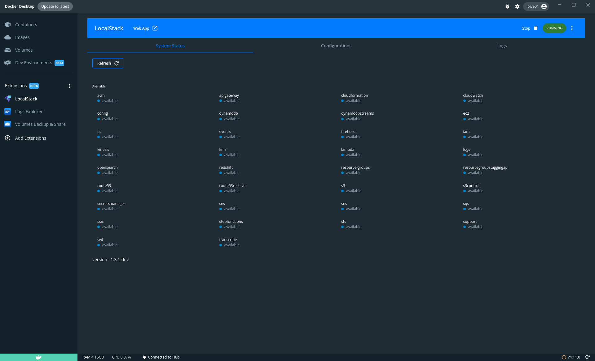

# LocalStack Docker Extension

The LocalStack Extension for Docker Desktop enables developers working with LocalStack to run their AWS applications or Lambdas entirely on their local machine without connecting to a remote cloud provider!

LocalStack empowers developers to use over 75+ AWS services locally while helping them simplify their testing and development workflow. LocalStack supports a comprehensive list of APIs, which you can view on our [Feature coverage](https://docs.localstack.cloud/aws/feature-coverage/) page.



## Installation

You can install the LocalStack Extension for Docker Desktop via pulling our public Docker image from Docker Hub:

```bash
docker extension install localstack/localstack-docker-desktop:0.5.1
```

To setup the Docker Extension by building the image locally, you can run the following commands:

```bash
make install-extension
```

It will build the Docker image and install the extension on your Docker Desktop application. After the installation, you will be prompted to select where LocalStack will be mounted. Open the drop-down and choose the username. You can additionally change this setting by navigating to the **Configurations** tab and selecting the mount point.

## Features

Currently, the LocalStack Extension for Docker Desktop supports the following features:

* **Control LocalStack**: Start, stop, and restart LocalStack from the Docker Desktop. You can also see the current status of your LocalStack instance and navigate to LocalStack Web Application.
* **LocalStack insights**: You can see the log information of the LocalStack instance and all the available services and their status on the service page. 
* **LocalStack configurations**: You can manage and use your profiles via configurations and create new configurations for your LocalStack instance.

## Contributing

To contribute, check out our [issue tracker](https://github.com/localstack/localstack-docker-extension/). To set up LocalStack Docker Extension for development, you can follow the steps below:

1. Clone the repository and install all the dependencies using `npm`:

    ```bash
    $ git clone https://github.com/localstack/localstack-docker-extension/
    $ cd ui
    $ npm install
    ```

2. Open the Developer Tools or create new features:
    ```bash
    $ make debug
    ```

3. Start the Extension on Docker Desktop and enable hot-reload using the following command:
    ```bash
    $ make hot-reloading
    ```

4. Disable hot reloading:
    ```bash
    $ make stop-hot-reloading
    ```
## Security maintenance

Most CVEs reported against this image come from the Go toolchain compiled into
the `service` binary rather than from any dependency manifest, so they are fixed
by rebuilding on a newer `golang:1.25-alpine` rather than by bumping anything.

The [weekly security rebuild](.github/workflows/security-rebuild.yml) does this
automatically: it scans the published image, rebuilds from scratch, and
republishes a new patch version **only if the rebuild actually clears a CVE**.
Rebuilds that change nothing are not released, so no update badge appears in
Docker Desktop for a no-op.

Anything a rebuild cannot fix needs a dependency bump. Dependabot raises those
against `vm/go.mod` as security updates; they are reviewed and tested by hand,
and released with the same workflow via `workflow_dispatch`.

### Validating a CVE fix locally

```bash
# What is currently published?
trivy image --scanners vuln --severity HIGH,CRITICAL --ignore-unfixed \
  localstack/localstack-docker-desktop:$(sed -n 's/^TAG?=//p' Makefile)

# Rebuild from scratch and rescan. --pull --no-cache matters: a cached base
# layer reproduces the old image and clears nothing.
docker build --pull --no-cache -t dde-candidate .
trivy image --scanners vuln --severity HIGH,CRITICAL --ignore-unfixed dde-candidate

# Check the rebuild still works before shipping it
make smoke-test
```

Test a change end to end in Docker Desktop with `make install-extension`.

## Releases

Please refer to [`CHANGELOG`](CHANGELOG.md) to see the complete list of changes for each release.

## License

This software is released under the Apache License, Version 2.0 (see [`LICENSE`](LICENSE)).
