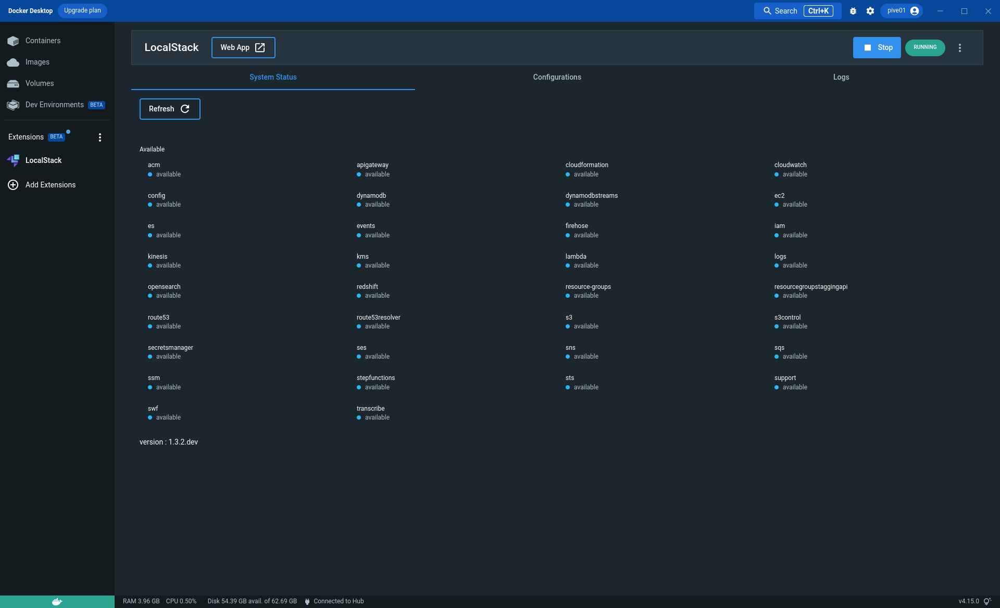

# LocalStack Docker Extension

The LocalStack Extension for Docker Desktop enables developers working with LocalStack to run their AWS applications or Lambdas entirely on their local machine without connecting to a remote cloud provider!

LocalStack empowers developers to use over 75+ AWS services locally while helping them simplify their testing and development workflow. LocalStack supports a comprehensive list of APIs, which you can view on our [Feature coverage](https://docs.localstack.cloud/aws/feature-coverage/) page.



## Installation

You can install the LocalStack Extension for Docker Desktop via pulling our public Docker image from Docker Hub:

```bash
docker extension install localstack/localstack-docker-desktop:0.2.0
```

To setup the Docker Extension by building the image locally, you can run the following commands:

```bash
make install-extension
```

It will build the Docker image and install the extension on your Docker Desktop application.

## Features

Currently, the LocalStack Extension for Docker Desktop supports the following features:

* **Control LocalStack**: Start, stop, and restart LocalStack from the Docker Desktop. You can also see the current status of your LocalStack instance and navigate to LocalStack Web Application.
* **LocalStack insights**: You can see the log information of the LocalStack instance and all the available services and their status on the service page. 
* **LocalStack configurations**: You can manage and use your profiles via configurations and create new configurations for your LocalStack instance.

## Contributing

To contribute, check out our [issue tracker](https://github.com/localstack/localstack-docker-extension/). To set up LocalStack Docker Extension for development, you can follow the steps below:

1. Clone the repository and install all the dependencies using `npm`:

    ```bash
    $ git clone https://github.com/localstack/localstack-docker-extension/
    $ cd ui
    $ npm install
    ```

2. Open the Developer Tools or create new features:
    ```bash
    $ docker extension dev debug localstack/localstack-docker-desktop
    ```

3. Start the Extension on Docker Desktop and enable hot-reload using the following command:
    ```bash
    $ npm start 
    $ docker extension dev ui-source localstack/localstack-docker-desktop http://localhost:3000
    ```

## Releases

Please refer to [`CHANGELOG`](CHANGELOG.md) to see the complete list of changes for each release.

## License

This software is released under the Apache License, Version 2.0 (see [`LICENSE`](LICENSE)).
